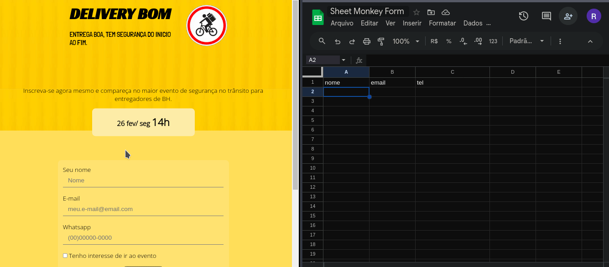
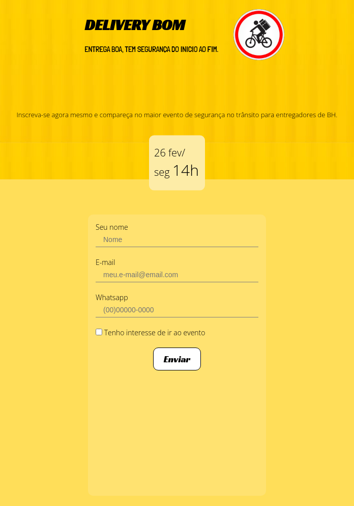
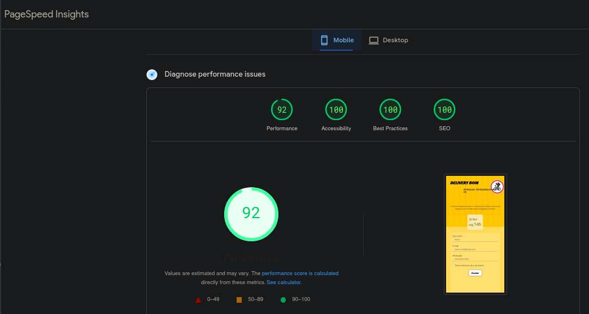

  
# -Pagina de captura para evento Elivery Bom

  
`clique na logo para abrir o site`  
  

Este projeto foi para um evento em parceria com o Ifood. O formulário irá atender a equipe de produção para gerenciamento de leads e recebimento e e-mail com links para compra dos ingressos. 
A lista de inscritos irá cair diretamente no google sheets por meio de uma integraçao usando JSON com featch. 
Posteriormente tenho como objetivo fazer o tratamento da lista com automatização de envio de email, e automação de envio de mensagens por WhatsApp.
O repositorio oficial não tem dominio proprio e foi criado um espelho no Netlify, travando as atualizações de commits por questões de testes no repositorio do github.

Este projeto irá atender em média 100 pessoas.
A feature de gerenciamento agrada mais o cliente do que o layout, acrescentando valor ao seu negocio e praticidade de gerenciamento.

 <table align="center" height="700px;">
  <tr> 
    <td>
      
    </td>
  </tr>
  <tr> 
    <td>
      
 Formatação 

      
    </td>
  </tr>
   <tr> 
    <td>
      
 Resultado google page speed 92%  

      
    </td>
  </tr>
 
 </table>

## Tecnologias utilizadas
- [x] HTML
- [x] CSS
- [x] JS 

## coisas que aprendi
- [x] Fazer o Post de um form via featch API
- [x] Integrar o google sheets a formularios com serviço sheet monkey
- [x] Hospedar projeto no Netlify
- [x] Criar projetos a partir de imagens sem ter wireframe
- [x] Comunicação com cliente

### Sugestões 

Aceito sugestões de melhorias assim como críticas ao projeto. 
Caso deseje faça seu fork e use a ideia como quiser. 
Parceria para designe de figma? aceito, é só me comunicar que tenho diversas ideias para colocar em prática.

# Contato 
Para saber como foi o processo de criação visite meu blog ou meu linkedin, mais projetos como esse entre em contato e me acompanhe nas redes sociais. 

&nbsp;
&nbsp; 📫

[contactrodrigues21@gmail.com](mailto:contactrodrigues21@gmail.com) 📫
